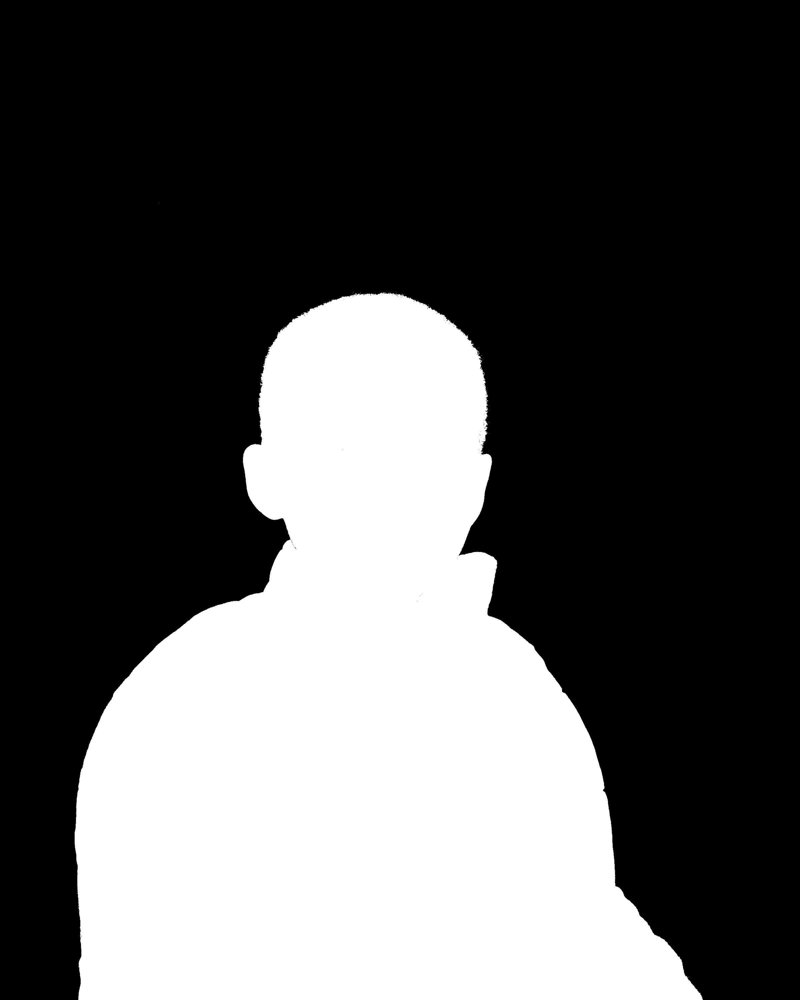
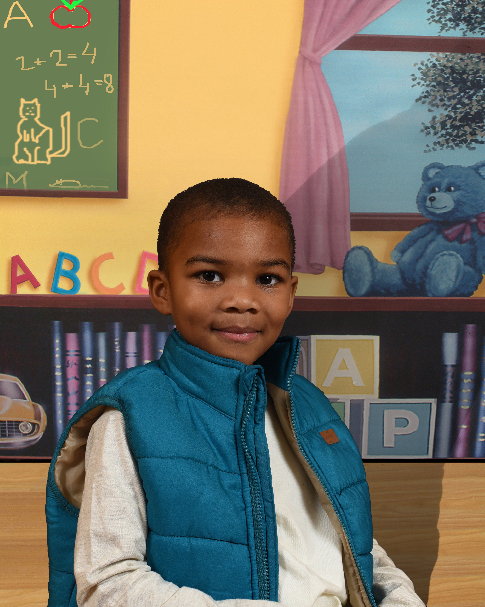
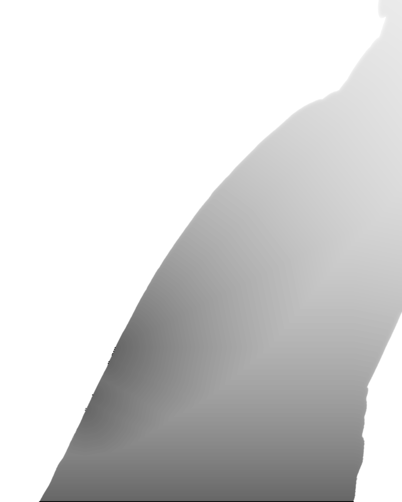
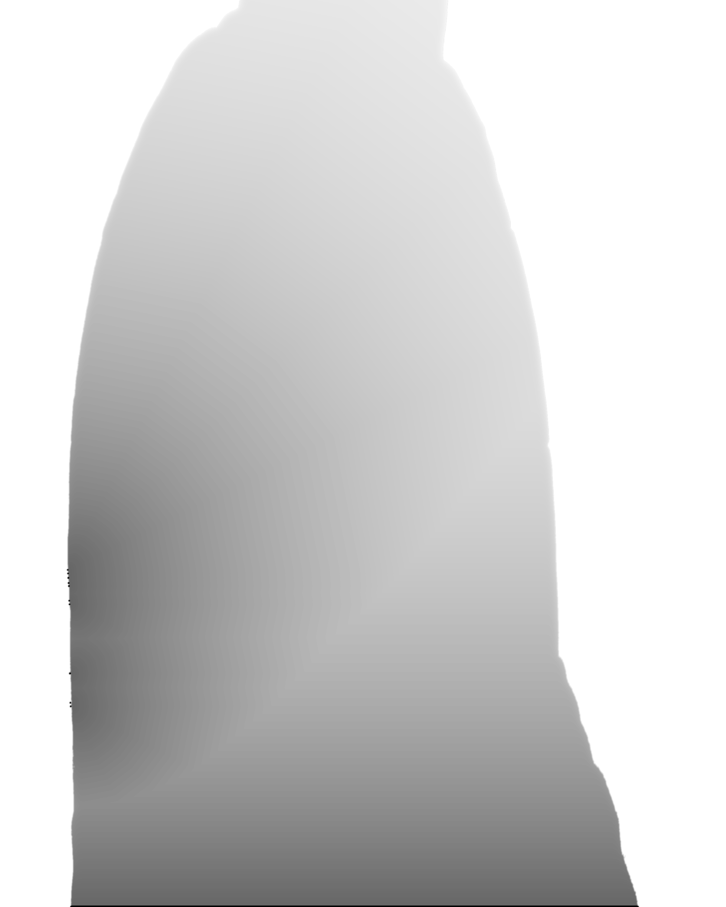
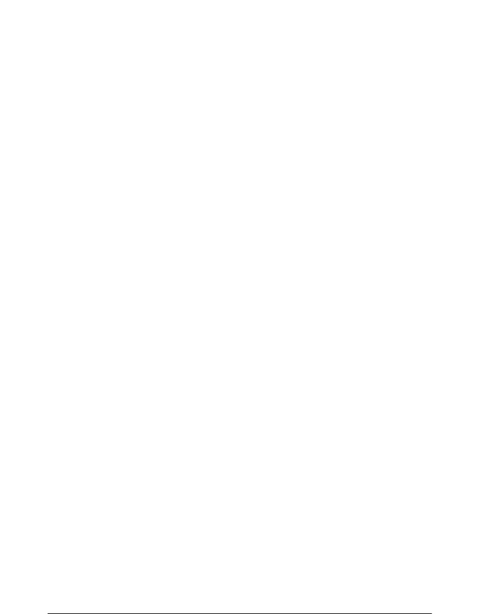

# Realistic Shadow Generator

Mini challenge implementation: realistic shadow generator for compositing foreground subjects onto backgrounds with believable shadows.

## Visual Example

### Input Images

| Foreground | Background | Mask |
|:----------:|:----------:|:----:|
|  |  |  |
| Subject with gray backdrop | Target background scene | Subject silhouette mask |

### Output

**Composite Result:**



**Shadow Variations (Different Light Angles):**

| Angle 135° | Angle 90° | Angle 225° |
|:----------:|:---------:|:----------:|
|  |  |  |
| Light from upper-left | Light from top | Light from lower-right |

The generator extracts the subject using the mask, places it on the background, and casts a realistic shadow based on light direction and elevation parameters.

## Features

- **Directional light control**: Light angle (0-360°) and elevation (0-90°)
- **Contact shadow**: Dark and sharp near feet/contact area with natural fadeout
- **Soft shadow falloff**: Blur and opacity increase with distance
- **Subject-matched shadows**: No oval shadows, uses actual silhouette
- **Optional depth map support**: Shadow bending/warping on uneven surfaces
- **Interactive GUI**: Real-time shadow adjustment with sliders

## Setup

**Requirements:**
- Python 3.9+
- Dependencies: `pip install -r requirements.txt`

## Usage

### CLI Mode

Basic usage with auto cutout (GrabCut):
```bash
python shadow_generator.py \
  --foreground "./25_1107O_11974 PB + 1 - Photo Calendar B_Lamborghini HAS.JPG" \
  --background "./B_Child Room.JPG" \
  --angle 135 --elevation 35
```

With custom mask:
```bash
python shadow_generator.py \
  --foreground "./subject.png" \
  --background "./background.jpg" \
  --mask "./subject_mask.png" \
  --angle 120 --elevation 40 --opacity 0.65
```

With depth map (bonus mode):
```bash
python shadow_generator.py \
  --foreground "./subject.png" \
  --background "./background.jpg" \
  --mask "./subject_mask.png" \
  --depth "./depth.png" \
  --angle 120 --elevation 40 --depth-strength 0.6
```

### GUI Mode

Launch interactive interface:
```bash
python shadow_gui.py
```

**GUI Features:**
- File selection for foreground, background, mask, and depth map
- Real-time sliders for all shadow parameters
- Live preview canvas
- One-click save for composite, shadow-only, and mask debug outputs

## Outputs

- `composite.png` 🖼️ - Final composited image
- `shadow_only.png` 🖤 - Debug: isolated shadow layer
- `mask_debug.png` ✂️ - Debug: subject mask

## Parameters

| Parameter | Description | Default | Range |
|-----------|-------------|---------|-------|
| `--angle` | Light angle (shadow cast opposite) | 135.0 | 0-360° |
| `--elevation` | Light elevation (lower = longer shadow) | 35.0 | 0-90° |
| `--opacity` | Base shadow opacity | 0.6 | 0-1 |
| `--blur-near` | Blur sigma near contact | 1.5 | 0.1-10 |
| `--blur-far` | Blur sigma far from contact | 12.0 | 1-30 |
| `--falloff` | Opacity decay rate | 2.0 | 0.1-5 |
| `--depth-strength` | Depth warp intensity | 0.6 | 0-2 |
| `--scale` | Foreground scale factor | 1.0 | >0 |

## Technical Notes

- **Light angle**: 0° = right, 90° = down, 180° = left, 270° = up
- **Elevation**: Controls shadow length via `tan(elevation)`
- **Auto cutout**: Uses GrabCut when no alpha channel or mask provided
- **Depth map**: Grayscale image (0-255) warps shadow projection
- **Contact shadow**: Computed from bottom-most pixels, enhanced near feet

## Architecture

- `shadow_generator.py`: Core CLI implementation
- `shadow_gui.py`: Tkinter GUI with real-time preview
- Compositing pipeline: mask extraction → shadow projection → depth warp → blend

## Deliverables

✅ Directional light control (angle + elevation)  
✅ Contact shadow (sharp near feet, fades with distance)  
✅ Soft shadow falloff (blur + opacity increase with distance)  
✅ Shadow matches subject silhouette  
✅ Bonus: Depth map warping for realistic surface bending  

---

**The School Photo Company / AMC Photo Inc.**
